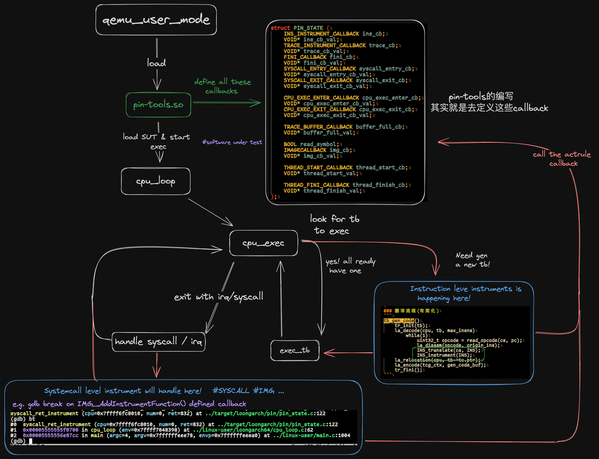

## 基于Qemu的龙架构平台高性能插桩工具

- 项目名称：基于Qemu的龙架构平台高性能插桩工具
- 学校：西南大学
- 队名：SWuOS
- 成员：林润泽 张正 肖翊豪

### 目标描述

[Pin](https://www.intel.com/content/www/us/en/developer/articles/tool/pin-a-dynamic-binary-instrumentation-tool.html)是Intel提供的一个动态二进制插桩工具，它可以用于性能分析、安全增强和程序分析等领域。本项目的目标是为龙架构平台提供一个类似的工具。由于Pin并不开放源代码，已有人在开源QEMU二进制翻译器基础上做了一些工作，可以作为项目参考。

1. 向 `qemu-instrument` 中添加 更多的 `pin-compatible` api
2. 按照[Pin: Pin 3.30 User Guide (intel.com)](https://software.intel.com/sites/landingpage/pintool/docs/98830/Pin/doc/html/index.html)里列出的基本pintools（对应intel-pin中`pin/source/tools/ManualExamples`） 进行补全
3. 针对以往已经实现，但是功能残缺/或者基本不起作用的api进行完善

### 系统框架分析

🐲pin的设计理念可以理解为把qemu作为“runtime”，利用qemu提供的一些"trap"的能力，
对于各种pin-tools抽象出来的对象，比如IMG，SYSCALL，INS，BBL，我们都可以在
qemu去接管这些对象该如何处理之前由我们去做一个预处理，这个处理就是通过pin-tools
定义的各种callback里用户可以自定义变成的部分。

对于指令级的插桩，本质上我们是在反汇编之后识别指令是否插桩，如果需要，我们就在这里加入跳转或者inline一些我们需要的指令。

对于irq/exception(syscall)级的插桩，主要也是在qemu自己本身的处理入口附近加一些我们callback的入口达到插桩的目的。


对于我们来说，其实主要的工作是在已有的codebase上去逐渐完善功能，对以前实现比较草率或者未实现的api进行补全。我们首先通过原来开发者写的的文档跟codebase中`pintools`用例跟`intel pin`官方的`Menuexample/User guide部分`做了一下分析，确定了我们初步可以下手的切入点。然后就是根据已有的基础设施去补齐缺失的用例中用到的`pin api`。
### 提交仓库目录和文件描述
- target/loongarch/CHIMAIN.md   : 我们对于项目API进度的分析
- target/loongarch/instrument   : 补的一些`instrument related api`实现部分
- target/loongarch/pin          : `pin-tools`内部数据结构，被pin对象的抽象，回掉的衔接
- target/loongarch/pin/pintools : 新更近的一些pintools用例
- target/loongarch/Makefile     : 我们用来同步服务器跟本地文件系统以及编译运行的脚本
### 环境搭建
```bash
git clone https://github.com/zzLinus/qemu-instrument.git

# 需要更换远程服务器地址跟文件路径等变量
make mkqemu && make mkpin && make
```
makefile不在本地做任何编译工作，需要通过3C5000服务器编译，测试

### 正确性测试
在makefile中选择打开需要测试的pin-tools。

- [x] IMG_SecHead()
- [x] SEC_Valid()
- [x] SEC_Next()
- [x] SEC_RtnHead()
- [x] RTN_Valid()
- [x] RTN_Next()
- [x] RTN_InsHead()
- [x] INS_Valid()
- [x] INS_Next()
- [x] RTN_Open()
- [x] RTN_Close()
对原来symbols.c部分对于IMG，SEC，RTN pin对象的重写/新实现。考虑到为进一步满足intel pin api的兼容性，实现了跟intel pin更相似的抽象。现在在`elfparse`中对`IMG->SEC->RTN->INS`的构建已经比较完整，对于SEC跟RTN对象部分补全了staticicount需要的api。

对于Thread跟buffering相关的api正在开发中
- [x] PIN_AddThreadStartFunction()
- [x] PIN_AddThreadFiniFunction()
- [x] PIN_DefineTraceBuffer()
- [x] PIN_CreateThreadDataKey()
- [x] PIN_SetThreadData()e
- [x] PIN_GetThreadData()
- [x] INS_InsertFillBuffer (INS ins, IPOINT action, BUFFER_ID id,...)
[🔧] INS_InsertFillBufferPredicated (INS ins, IPOINT action, BUFFER_ID id,...)
[🔧] INS_InsertFillBufferThen (INS ins, IPOINeESeeT action, BUFFER_ID id,...)
对于正在适配的buffer_linux pintools，期中每个buffer是作为一个TLS数据存储的，这里需要通过各种pthread的api进行合理的管理，我们目前完成了ThreadStart ThreadFinish相关的pin api，计划下一步进行Thread TSL，Buffering api功能的开发

